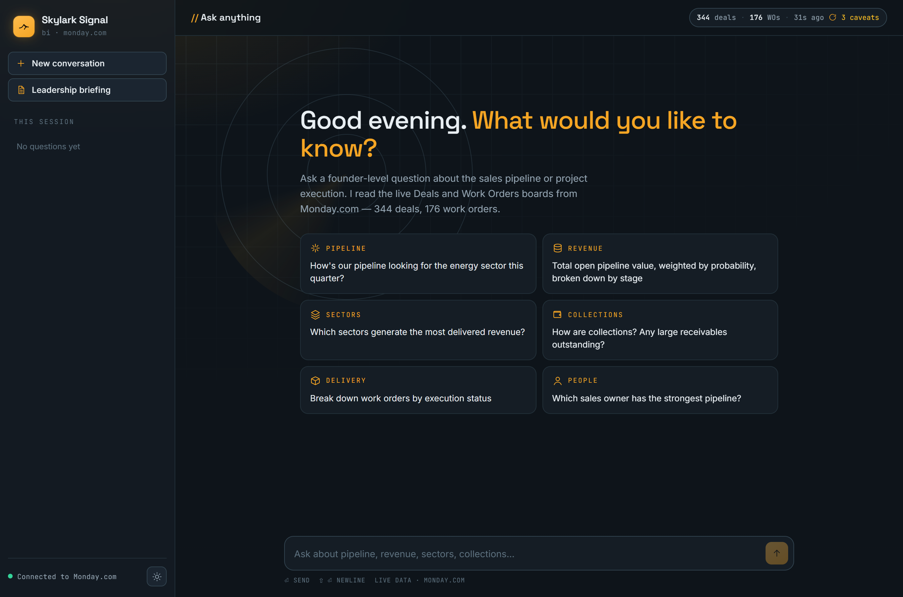
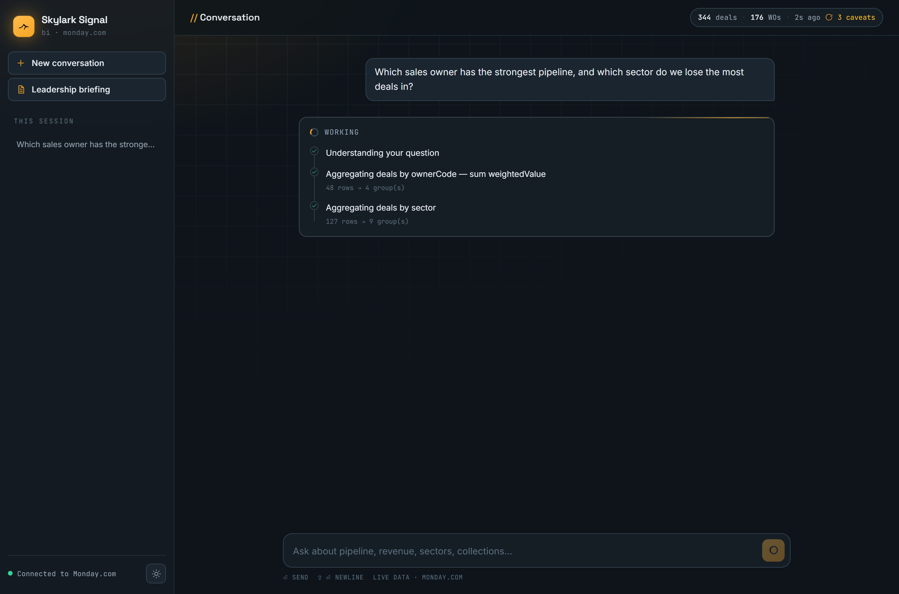
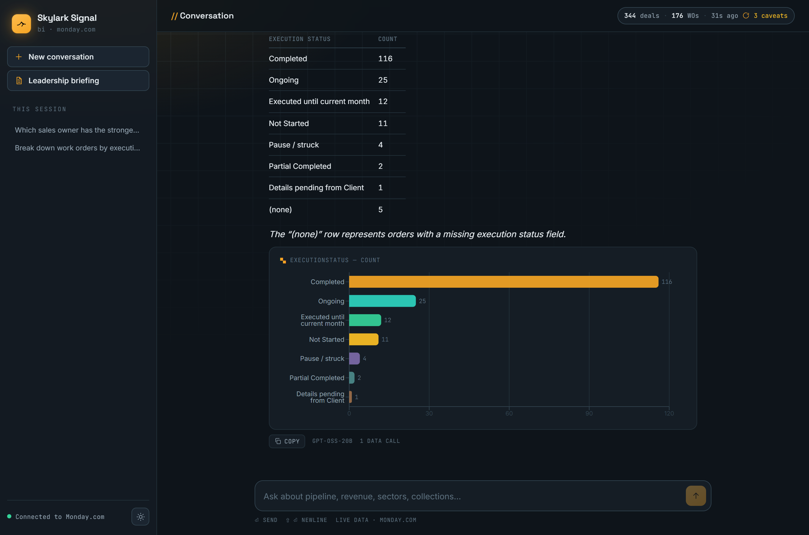
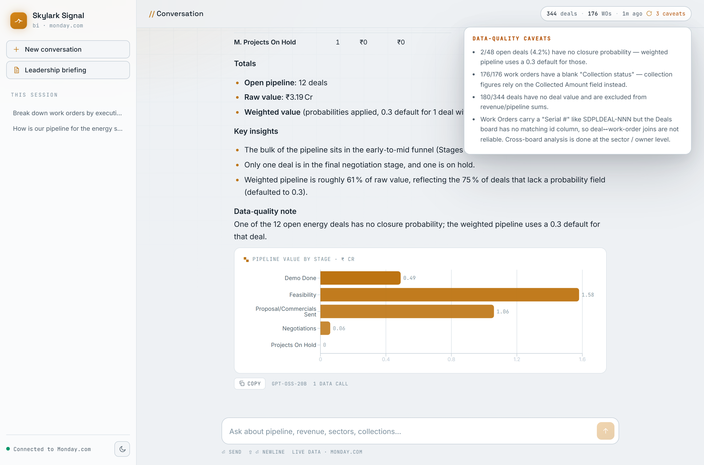
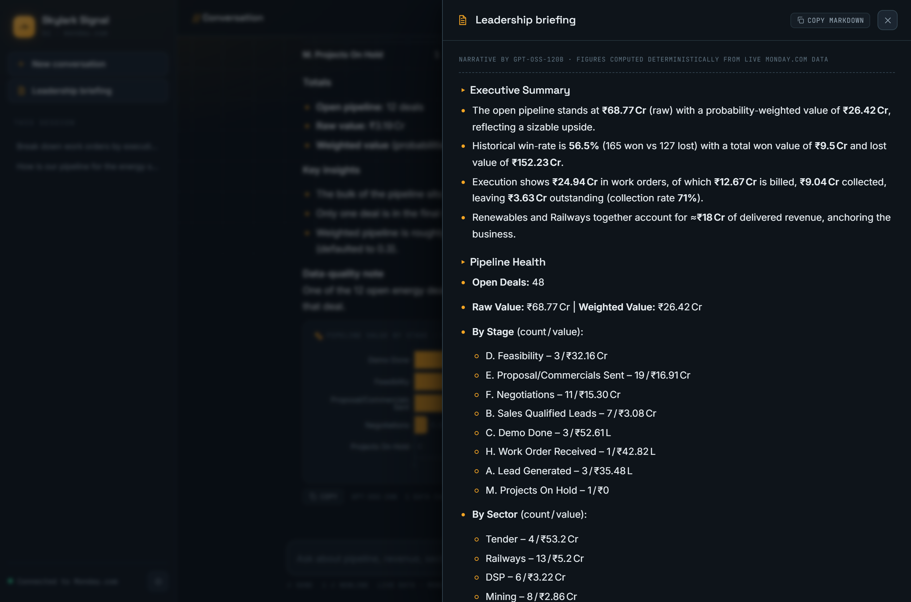
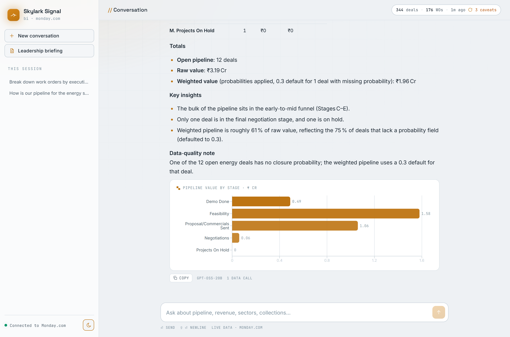
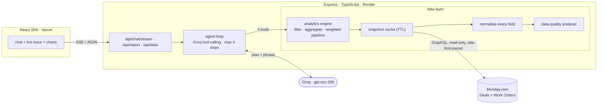
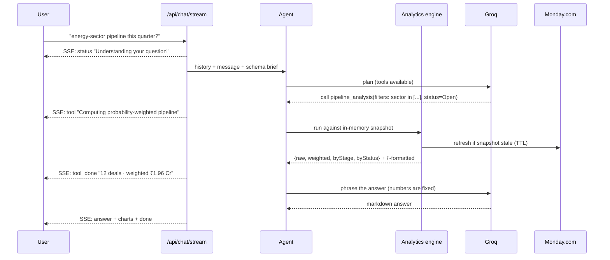

<div align="center">

# Skylark Signal

### Ask your Monday.com boards a founder-level question. Get an answer, a chart, and the caveats — in one sentence of English.

[](https://github.com/Kuladeep-Reddy-C/SkyLarkDrones/actions/workflows/ci.yml)
&nbsp;
&nbsp;
&nbsp;[](LICENSE)

**[▶ Live app](https://sky-lark-drones-kulli.vercel.app)** &nbsp;·&nbsp; **[API](https://skylarkdrones-shbc.onrender.com/api)** &nbsp;·&nbsp; **[Decision Log](docs/DECISION_LOG.md)**



</div>

---

A conversational business-intelligence agent over two Monday.com boards — **Deals** (sales
pipeline) and **Work Orders** (project execution). It reads the *live* boards, cleans the
real-world mess (inconsistent dates, `"Dead"` deals, masked money, missing fields), and
answers questions a founder would actually ask — *"How's the energy-sector pipeline this
quarter?"* — with a number, a chart, and an honest note about what the data can't tell you.

Built for the Skylark Drones full-stack assignment (6-hour brief). The result is a
production-shaped TypeScript monorepo, not a notebook.

<details>
<summary><b>Contents</b></summary>

- [What makes it different](#what-makes-it-different)
- [See it in action](#see-it-in-action)
- [Architecture](#architecture)
- [A question's journey](#a-questions-journey)
- [Quickstart](#quickstart)
- [Tech stack &amp; decisions](#tech-stack--decisions)
- [Testing &amp; CI](#testing--ci)
- [Production readiness](#production-readiness)
- [Assignment context](#assignment-context)

</details>

---

## What makes it different

Most "chat with your data" demos are a prompt, an API key, and a hope that the model does
the math. This one is engineered around the places that actually break.

### 1 · The LLM never does arithmetic

Every number comes from a **deterministic query engine** (`agent/analytics.ts`) — filter,
group, aggregate, weighted-pipeline — that the model *drives* but never computes. Tool
results even ship **pre-formatted money** (`"₹9.04 Cr"`), because a smaller model will
happily turn `90,428,187` into *"₹90.4 crore"* (it's `₹9.04` — a 10× error I hit and then
designed out). The model chooses *what* to ask and phrases the answer; the engine owns
correctness. Unit-tested with the null-handling regressions baked in.

### 2 · You watch the agent think

`POST /api/chat/stream` emits Server-Sent-Events (`status → tool → tool_done → answer →
charts → done`). The UI turns that into a live console — each step with its real tool call
and a one-line result — so "the agent is working" is *shown*, not spun.



### 3 · Charts for free

Any answer with a breakdown renders a bar or funnel chart **built from the agent's own
aggregation results** — zero extra LLM calls, zero extra tokens. One consistent unit per
series (the "mixed ₹Cr / ₹L axis" bug is a test).



### 4 · It tells you what the data can't

A data-quality pass runs on every snapshot: fill-rates, per-row issues, cross-board join
caveats. Those surface **in the UI** and **in every affected answer** — you never see a
pipeline number without *"…but 75% of open deals have no probability"*.



### 5 · Rate-limit engineering you don't see

Monday bills GraphQL complexity as `limit × per-row cost` — a naive `boards(limit:200){
items_count }` exhausts the **entire** 1,000,000/min budget in one call (this is why the
first attempts 429'd relentlessly). The client now **paces itself on the `ratelimit`
response header**, pausing before the budget runs out. The one-time importer is
rate-limit-aware *and* resumable.

### 6 · It degrades gracefully

LLM unavailable? `/api/chat` still returns a correct, deterministic data summary instead
of an error. The leadership briefing falls back from an LLM narrative to a templated one
with the *same* numbers. Nothing is blocked on the model.

### 7 · Production-shaped, not prototype-shaped

Full **strict TypeScript** monorepo (npm workspaces), **zod**-validated config + requests,
**42 Vitest** tests, **ESLint + Prettier**, and **GitHub Actions CI** (format → lint →
typecheck → test → build) on every push. `backend/src/types.ts` is the single source of
truth; the frontend mirrors the wire contract.

---

## See it in action

| | |
|---|---|
|  | **One-click leadership briefing.** Numbers computed deterministically from the live snapshot; an LLM turns them into board-ready prose (and is told *not* to touch the figures). Falls back to a template if the model is down. |
|  | **Two themes, dark-first.** Flight-console aesthetic — telemetry grid, signal-amber accent, animated radar on the empty state. `prefers-reduced-motion` respected. |

---

## Architecture



- **Data flow** — `data/store.ts` pulls every item from both boards on a short TTL,
  normalises each field, and exposes a typed `Snapshot`. Nothing is hardcoded from the CSVs.
- **Agent** — a Groq tool-calling loop. The field catalog + current caveats are injected
  into the system prompt (`agent/schemaBrief.ts`), so most questions resolve in **2 LLM
  calls**. An answer cache makes repeat questions instant and free.
- **Charts** — derived from the agent's aggregation results in `agent/charts.ts`.

<details>
<summary><b>Backend module map</b></summary>

| Path | Responsibility |
|---|---|
| `config.ts` | env parsing + validation (zod), fail-fast |
| `monday/client.ts` | Monday GraphQL client — retry + **per-minute complexity-budget pacing** |
| `data/normalize.ts` | messy dates / units / null placeholders / sector + status canonicalisation |
| `data/schema.ts` | canonical column definitions — used by the importer *and* the reader |
| `data/store.ts` | snapshot fetch + normalise + cache → typed `Snapshot` |
| `data/quality.ts` | fill-rates, per-row issues, cross-board caveat |
| `agent/analytics.ts` | pure filter / aggregate / weighted-pipeline / `fmtINR` (unit-tested) |
| `agent/tools.ts` | the 5 agent tools + the field catalog surfaced to the model |
| `agent/agent.ts` | tool-calling loop, SSE events, answer cache |
| `agent/charts.ts` | tool results → Recharts specs |
| `reports/leadership.ts` | deterministic metrics + optional LLM narrative |
| `scripts/importToMonday.ts` | one-time ETL: spreadsheets → two Monday boards (resumable) |

</details>

## A question's journey



---

## Quickstart

```bash
git clone https://github.com/Kuladeep-Reddy-C/SkyLarkDrones
cd SkyLarkDrones
npm install                          # both workspaces

cp backend/.env.example backend/.env # set MONDAY_API_TOKEN and GROQ_API_KEY
npm run import -w backend            # reads ./*.xlsx → builds "Deals" + "Work Orders" boards

npm run dev                          # backend :8080 + frontend :5173
```

<kbd>⏎</kbd> sends · <kbd>⇧</kbd> <kbd>⏎</kbd> newline · toggle the theme from the bottom of the rail.

```bash
npm run check              # format + lint + typecheck (both) + tests — run before pushing
npm run smoke -w backend   # data layer + analytics vs. live Monday, no LLM
```

<details>
<summary><b>API reference</b></summary>

| Method | Path | Description |
|---|---|---|
| `GET`  | `/api/data/health` | Monday + LLM connectivity |
| `GET`  | `/api/data/overview[?refresh=1]` | counts + data-quality report |
| `POST` | `/api/data/refresh` | force a fresh Monday pull |
| `POST` | `/api/chat` | `{ message, conversationId? }` → `{ reply, charts, meta }` |
| `POST` | `/api/chat/stream` | same input, Server-Sent-Events |
| `GET`  | `/api/report/leadership[?narrative=0]` | leadership briefing (Markdown + metrics) |
| `GET`  | `/api/report/leadership/metrics` | just the computed numbers |

</details>

---

## Tech stack &amp; decisions

| Choice | Why |
|---|---|
| **Local analytics over LLM-written queries** | 520 rows fits in memory. Deterministic, testable, and the model can't hallucinate query syntax or numbers. Still "dynamic" — every refresh re-queries Monday. |
| **Groq `gpt-oss-20b`** (fallback `120b`) | Free tier, fast, tool-calling. Client is provider-agnostic (OpenAI shape) — swapping is one line. |
| **No database** | Monday is the system of record and it's read-only; conversation history is disposable. The `store` layer is a clean seam if durable caching is ever wanted. |
| **Load data into Monday as-is** | Monday stays a faithful mirror of the messy source; normalisation happens at query time — which *is* the "agent cleans the data" requirement. |
| **Full TypeScript + workspaces + CI** | It's a portfolio piece as much as an assignment. |

Full assumptions, trade-offs, and the "leadership update" interpretation → **[docs/DECISION_LOG.md](docs/DECISION_LOG.md)**.

## Testing &amp; CI

- **42 Vitest tests** — field normalisation (messy dates, `"5360 HA"`, `"Dead" → Lost`),
  the query engine's null-handling regressions, chart unit-scaling, SSE frame parsing,
  request-schema validation.
- **GitHub Actions** runs `format:check → lint → typecheck → test → build` on every push
  and PR; tests run **without secrets** (a setup file provides safe env defaults).

## Production readiness

Deployed and working, but honestly scoped. Before real users:

- [ ] Auth (the app exposes business data on a public URL)
- [ ] Per-IP rate limiting (protects the shared Groq / Monday quotas)
- [ ] Sentry + structured logging
- [ ] Evict the in-memory conversation store (TTL/LRU)
- [ ] Paid LLM tier (free Groq rate-limits under load)
- [ ] `helmet`, request timeout, graceful shutdown
- [ ] A recorded-fixture eval suite (~25 golden Q&amp;A with expected numbers)

## Assignment context

Skylark Drones asked for an AI agent that answers founder-level BI queries across two
Monday.com boards, handling real-world messy data gracefully, in ~6 hours. This repo is
that — plus the engineering I'd want around it. `MERN`-ish by request: **M**onday as the
data layer, **E**xpress, **R**eact, **N**ode — MongoDB deliberately omitted (see the
Decision Log).

<div align="center"><sub>MIT · built by Kuladeep Reddy C</sub></div>
